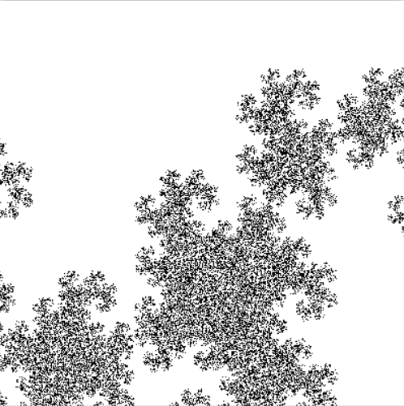

# A0：迭代函数系统（IFS）
## 任务概述

6.837的第一个作业，实现IFS算法。目的是熟悉C++的语法特性，并且熟悉使用两个和图像生成和线性代数相关的简单库。通过生成一些奇妙的分形物体来体会图形学的乐趣。

IFS **是一种构造分形的方法，得到的分形通常是自相似(self-similar)的**。IFS最经典的例子是绘制一种蕨类植物(Barnsley’s fern)，如下图所示，可以看到，每一个子叶片与整个叶片的形状相同。

IFS由**一个仿射变换(affine transformations)集合所定义，通常定义的仿射变换包括旋转(rotation)、缩放(scale)、平移(translations)、斜切(skew)等等线性变换方法**。这些变换不着了自相似的物体形状。IFS可以定义在多个维度上，在这个作业中，我们只需实现二维的变换。

## 实现细节
本实验已经提供了matrix.h、vectors.h、image.h、image.cpp、matrix.cpp5个文件
而我们要实现的文件是ifs.h、ifs.cpp、main.cpp
因此本实验的关键是实现输入和ifs算法

### ifs类的创建
```cpp
#include "matrix.h"
#include "image.h"
#include "vectors.h"
class IFS {
private:
	//仿射变换的个数
	int n;
	//仿射变换矩阵数组
	Matrix* matrix;
	//每一个仿射变换的选取概率数组
	float* prob;
public:
	//构造函数，使用仿射变换个数初始化
	IFS():n(0),matrix(nullptr),prob(nullptr){}
	//析构函数
	~IFS() {
		delete[] matrix;
		delete[] prob;
	}
	//读取IFS输入
	void input(const char* file);
	//绘制IFS图片
	void render(Image& image, int num_points, int num_iters);
};
```
### IFS输入的实现
```cpp
void IFS::input(const char* file) {
	FILE* input = fopen(file, "r");
	assert(input != nullptr);//断言帮助调式解决逻辑bug
	//从一个流中执行格式化输入，fscanf遇到空格和换行时结束，注意空格时也结束
	fscanf(input, "%d", &n);//读取变换的数量
	matrix = new Matrix[n];
	prob = new float[n];
	for (int i=0;i<n;i++)
	{
		fscanf(input, "%f", &prob[i]);//读取变换的概率
		matrix[i].Read3x3(input);//读取变换的3x3浮点矩阵
	}
	fclose(input);//关闭输入流
}
```
### IFS算法的实现
```cpp
void IFS::render(Image& image, int num_points, int num_iters) {
	int width = image.Width();
	int height = image.Height();
	for (int i=0;i<num_points;++i){

		Vec2f v = Vec2f(rand() * 1.0f / RAND_MAX, rand() * 1.0f / RAND_MAX);
		for (int j = 0; j < num_iters; ++j) {
			int k = 0;
			float sum = 0;
			float t = rand() * 1.0f / RAND_MAX;
			for (;k<n;++k){
				sum += prob[k];
				if (sum > t) break;
			}
			matrix[k].Transform(v);
		}
		if (v.x() >= 0 && v.x() <= 1 && v.y() >= 0 && v.y() <= 1) {
			image.SetPixel(v.x() * width, v.y() * height, Vec3f(0.0, 0.0, 0.0));
		}
	}
}
```
这里我不是很懂这个算法的思想，主要是参考了别人的代码完成

## 实验结果




## 参考资料
- https://github.com/nycshisan/MIT6_837_Assignments/tree/master/src
- [vs2013遇到fopen不安全替换fopen_s的问题](https://blog.csdn.net/u012420309/article/details/52948729)
- [VS中多级目录的写法](https://www.cnblogs.com/132818Creator/p/11014639.html)
- [CMAKE的学习](https://blog.csdn.net/poinsettia/article/details/17138801)
- https://github.com/fuzhanzhan/MIT-CG6.837-2004
- [(MIT 6.837)迭代函数系统IFS画自相似图形的算法](https://blog.csdn.net/wonggonghong/article/details/16381975)