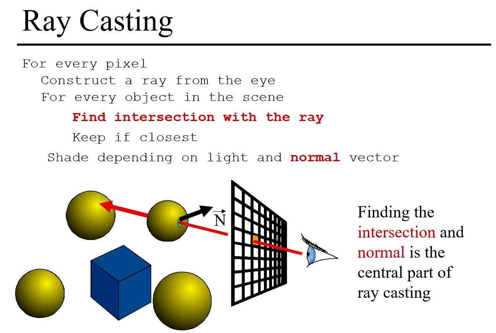
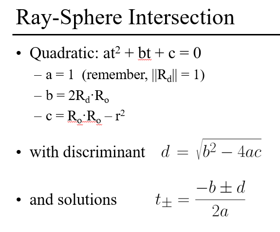
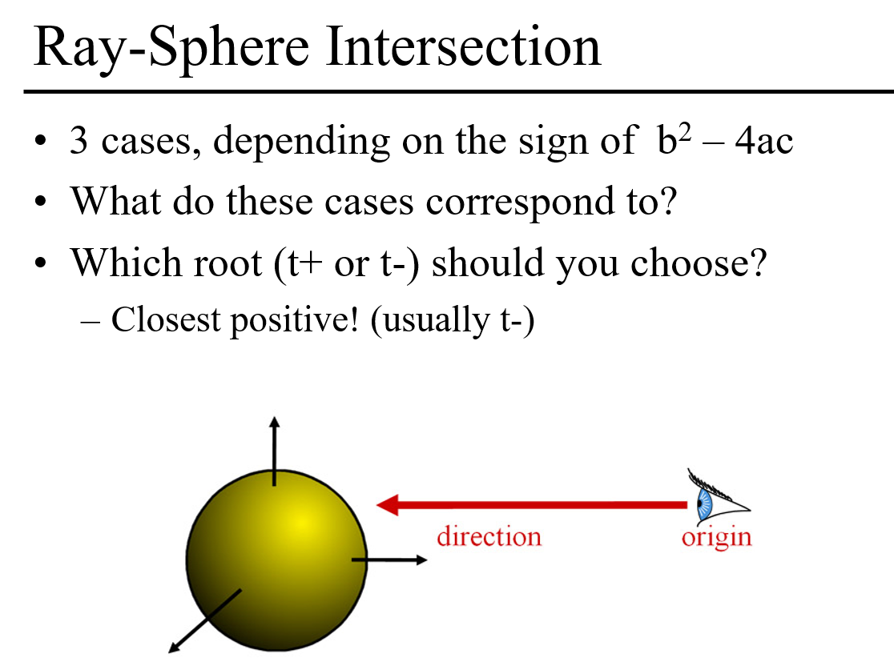
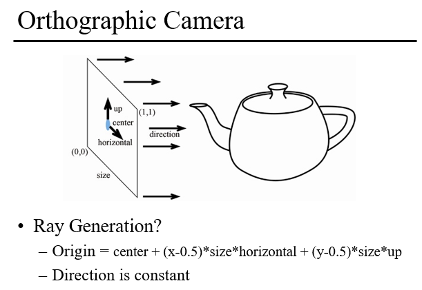
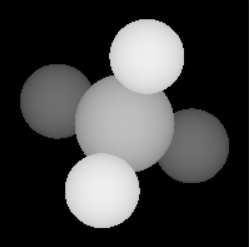
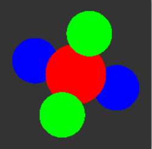

# A0：[Ray Casting](http://groups.csail.mit.edu/graphics/classes/6.837/F04/assignments/assignment1/)（光线投射)

***

## 学术名词
> camera obscura：针孔照相机
Perspective：透视投影
Orthographic：正交投影
Parallel projection：平行投影
Ray-Plane Intersection：射线与平面相交
Ray-Sphere Intersection：射线与球面相交
orthonormal basis：标准正交基
Ray Casting：光线投射
Ray tracing：光线追踪
Geometric：几何学
Algebraic：代数学
Object-Oriented Design：面向对象设计

## 实验概述

本实验的目标是要完成一个光线投射算法。光线投射算法的原理如下图（文字部分为个人见解）：
- 对于每一个像素
- &emsp;构建一条从视点处开始的射线
-    &emsp;&emsp;对场景中的每一个对象
       &emsp;&emsp;判断当前射线是否和当前对象有交点（此处要用到求交点函数）
    &emsp;&emsp;如果有且该交点距离视点更近，则更新最近交点值



下面说明一下本实验完成过程的重点。
### 射线和球模型的计算交点方法的实现
此处采用的是Algebraic方法，该方法的实现不是很难理解，根据PPT的公式及实验讲解即可完成该部分。Geometric方法使用较少因此没有实现。




```cpp
bool Sphere::intersect(const Ray& r, Hit& h, float tmin) {
	bool flag = false;//有交点返回true
	Vec3f ro = r.getOrigin() - center;//ro:射线到球中心的向量
	Vec3f rd = r.getDirection();//射线方向
	float a = rd.Dot3(rd);//rd与rd点积
	float b = 2 * ro.Dot3(rd);//ro与rd点积,可能为负
	float c = ro.Dot3(ro) - radius * radius;
	float delta = b * b - 4 * a * c;
	
	//float t;//当前距离,此处可以不用
	//获取最近的交点
	if (delta >= 0) {
		float d = sqrt(delta);//一定为正
		float t1 = (-b - d) / (2 * a);//通常t1更小
		float t2 = (-b + d) / (2 * a);
		// For an orthographic camera, rays always start at infinity, so tmin will be a large negative value
		//由于本节作业是正交相机，正交相机的tmin为无穷大，因此下面这块代码可以不用
		//if (t1 >= tmin) {//在origin之前
		//	t = t1;
		//}
		//else if (t2 >= tmin) {
		//	t = t2;
		//}
		if (t1 < h.getT()) {//closer当前交点，更新
			h.set(t1, material, r);
			flag = true;
		}
	}
	return flag;
}
```

### 正交相机的实现

直接参见PPT上给出的原理进行实现

```cpp
Ray OrthographicCamera::generateRay(Vec2f point) {
	Vec3f ro = center + (point.x() - 0.5) * horizontal * size + (point.y() - 0.5) * up * size;//射线起始点到对象中心
	return Ray(ro, direction);
}
```

### 光线投射算法的实现

该函数在主函数中进行了实现，代码如下

```cpp
    /*输入——初始化场景、相机、对象组及两幅图像*/
	SceneParser scene(input_file);
	Camera* camera = scene.getCamera();
	Object3D* group = scene.getGroup();
	Image image(width, height);//设置图像大小
	image.SetAllPixels(scene.getBackgroundColor());//图像背景颜色设置为场景背景颜色
	Image depthImage(width, height);//设置深度图像
	depthImage.SetAllPixels(Vec3f(0.0, 0.0, 0.0));//设置成黑色

    //光线投射
	/*循环遍历图像平面中的像素，使用OrthographicCamera类生成射线，将其与Group中的各个对象求交点，并将最近点保存到hit中*/
	for (int i=0;i<width;++i){
		for (int j = 0; j < height; ++j) {
			float x = float(i) / float(width);
			float y = float(j) / float_t(height);
			Ray ray = camera->generateRay(Vec2f(x, y));//产生射线
			Hit hit(INFINITY, nullptr);//hit存储最近的交点，此处初始t设置为了无穷大
			bool flag = group->intersect(ray, hit, camera->getTMin());//使该条射线和每一个基本图元求交点
			if (flag) {//如果存在交点
				image.SetPixel(i, j, hit.getMaterial()->getDiffuseColor());//设置该点像素的颜色
				float t = hit.getT();
				//可视化深度t
				//超过则设置为边界值
				if (t > depth_max) t = depth_max;//此处max=1、min=0
				if (t < depth_min) t = depth_min;
				t = (depth_max - t) / (depth_max - depth_min);//t越小越近，越近的颜色越深
				depthImage.SetPixel(i, j, Vec3f(t, t, t));//设置颜色值
			}
		}
	}
```

## 实验结果
    


## 实验总结

在实验的过程中，阅读完实验讲义和PPT，不是很明白实验需要完成那些内容。因此我直接参考了别人已完成的代码，并对需要实现的部分一点点对着阅读和理解。边看代码边看PPT和实验讲义，对每个文件每个函数充分理解，实验也逐渐完成，本实验也是之后实验的重点，需要充分弄明白。
自己完成实验的步骤：
1.通看PPT
2.通看实验讲义
3.执行别人的代码
4.在不懂的情况下阅读实验讲义、PPT并阅读别人的代码
-   记录自己要编写那些文件，完成那些函数
-   记录这些函数的实验原理，进一步理解这些算法的思想
-   记录下参考过的资料
-   重复该过程，直到弄懂
  
5.整理实验，并写成报告


## 参考资料

- https://blog.csdn.net/weixin_40552524/article/details/104436544
- https://www.cnblogs.com/fengyuheliu/archive/2011/08/28/2155627.html