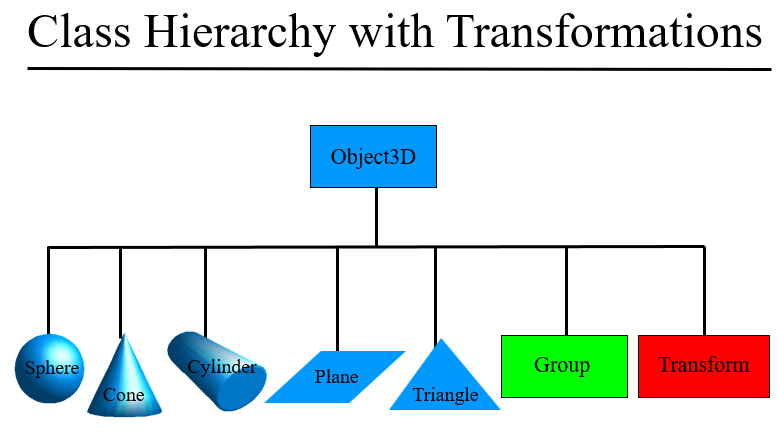

# A2：[Transformations & Additional Primitives](http://groups.csail.mit.edu/graphics/classes/6.837/F04/assignments/assignment1/)
----

## 实验概述
本实验的目标是实现更多的基本图元（如Plane、Triangle类的实现）、新增两种渲染模式(normal visualization和diffuse shading)、新增PerspectiveCamera类及变换(Transform类)的实现。

## 实验步骤

### 1 TASK分析

下面右边的序号是在实验中实际完成的顺序

[1] Object中更新球的计算交点方法【3】
[2] Object中派生出plane【2】，并实现其求交点方法【3】

[3] Object中派生出Triangle【2】，并实现其求交点方法【3】

<b>红色部分即为|A|</b>

[4]Object中派生出Transform【2】
[5]实现Transform类的求交点方法【3】
[6]实现normal visualization和diffuse shading的渲染模式【4】
>在主函数中实现两个渲染模式，同时封装一下命令解析代码

[7]在Camera中派生出PerspectiveCamera【1】

### 2 代码结构分析

不需要的编写的文件
> hit.h（A2更新）、light.h（A2给出）、ray.h、vectors.h、materials.h、image.h(c)、matrix.h(c)、scene_parser.h(c)（A2更新）
需要编写的文件
> camera.h(c)、main.c、object3d.h(c)、
## 注意点(Hints)
除实验中给出的Hints，这里给出自己在完成过程中遇到的不懂之处。

1 virtual ~Object3D() {} 为什么加virtual，有什么含义？
> 上述写法叫虚析构函数，和其他函数一样，我们通过在基类中将析构函数定义成虚函数以确保执行正确的析构函数版本；当我们delete一个动态分配的对象的指针时将执行析构函数，如果该指针指向继承体系中的某个类型，则有可能出现指针的静态类型与被删除对象的动态类型不符的情况。

2 virtual 和 override
> override只能对virtual进行重写

3 叉乘坐标系的表示方式
> 右手法则（right hand rule）

4 new并delete指针数组的方式
> [见此博客](https://www.cnblogs.com/chenhuan001/p/7373448.html)

5 C/C++ assert()函数用法
> [见此博客](https://blog.csdn.net/myyllove/article/details/82898875)

6 error C2065: “M_PI”: 未声明的标识符
> [见此博客](https://www.cnblogs.com/zzsama/p/10993125.html)

## 实验结果

部分实验结果如下:

 
 

## 源代码

[xdobetter的github]()