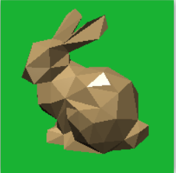
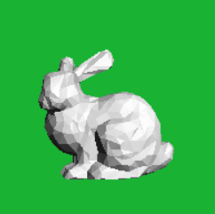

# A3：[Assignment 3: OpenGL & Phong Shading](http://groups.csail.mit.edu/graphics/classes/6.837/F04/assignments/assignment3/)
----

## 实验概述

- 实现交互式相机
- 实现Blinn-Phong光照模型及对应的光滑明暗处理技术
- 实现绘制各个图元的方法，尤其是球图元的绘制

## Hints

#### 1、Phong模型与Bling-Phong的区别

- Phong适合模拟塑料，比"反射"材质表现出的介质更光滑一些，适合模拟玻璃、水、冰等高反光特性的介质
- BlinnPhong大多适用于金属材质

- Blinn-Phong它能提供比Phong更柔和、更平滑的高光，而且速度上也更快，因此成为很多CG软件中默认的光照渲染方法，同时也被集成到大多数的图形芯片中

#### 2、光滑明暗处理技术

- 平坦着色（Flat Shading）

算法思想：
>通过三角形三顶点的坐标计算出整个三角形的法向量。
优缺点：
>这样就导致相邻两个三角形的法向量差别很大，所以就能看到明显的三角形的边。

- Gouraud光亮度插值技术

算法思想：
> 将曲面表面某一点的光亮度做近似表示，近似值取为该曲面的各多边形顶点光亮度的双线性插值。

优缺点：
>采用Gouraud明暗处理不但可以克服由多边形近似表示的曲面的光亮度不连续现象，而且计算量也很小。
> 1.不能正确地模拟高光。这是因为采用光亮度插值后将使多边形内的高光丢失。
> 2.所绘制画面会诱发马赫带效应。
> 虽然光亮度双线性插值保证了由多边形近似表示的曲面上各处光亮度的连续变化，但在相邻多边形的公共边界上光亮度的一阶导数并不连续，由于人眼的光学错觉，光亮度变化一阶不连续的边界处会呈现亮带或黑带，即马赫带效应。
> 3.克服这些缺点的一种方法是采用Phong明暗处理。

- Phong法向量插值技术

算法思想：
>它的基本思想是对多边形顶点处（平均）法向量做双线性插值，以增加一定的计算量为代价克服了Gouraud明暗处理的缺点。

优缺点：
>1.优点：绘制的图形比Gouraud方法更真实
>2.缺点：计算量远大于Gouraud方法

## 实验结果

部分结果如下：

## 参考资料
- [符佬的github](https://github.com/fuzhanzhan/MIT-CG6.837-2004)
- [奇异矩阵](https://baike.baidu.com/item/%E5%A5%87%E5%BC%82%E7%9F%A9%E9%98%B5/9658459?fr=aladdin)
- [extern的使用](https://www.cnblogs.com/yuxingli/p/7821102.html)
- [逆矩阵的含义和应用](https://www.mathsisfun.com/algebra/matrix-inverse.html)
- [phong光照模型](https://wenku.baidu.com/view/4e6443ea9b89680202d8250f.html)（此中文PPT讲的还不错）

## 源代码

[Github]()